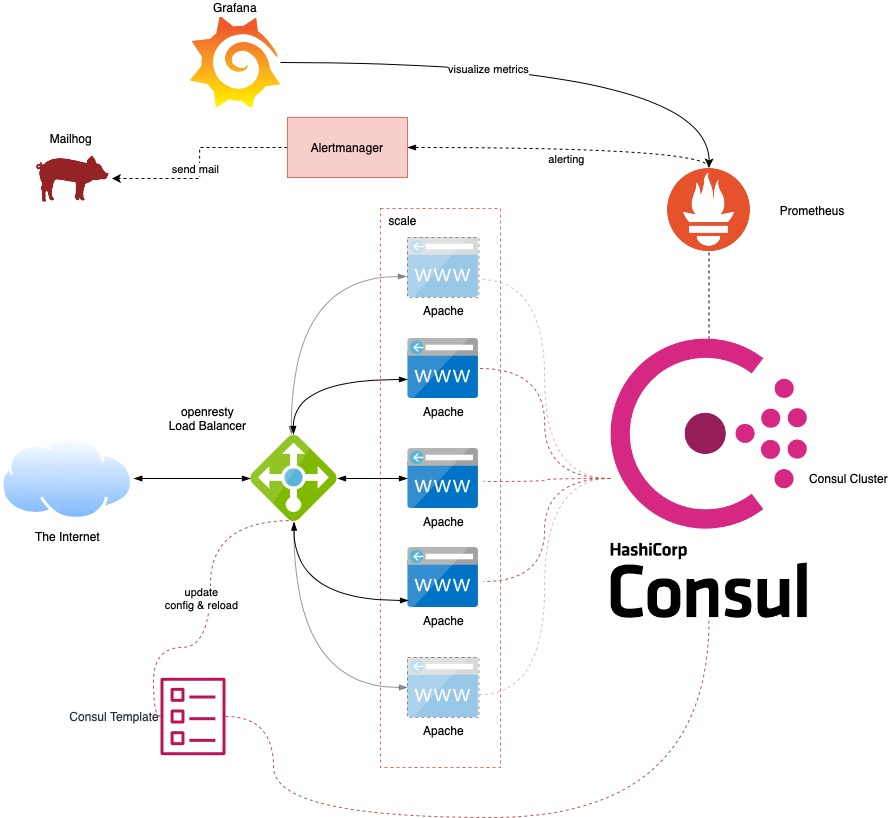

# Load Balancing with openresty and Consul Template, monitoring with Prometheus
 

* Registering each Apache instance within Consul
* update openresty's upstream using Consul Template and reload openresty in case changes happen to the array of webservers
* monitor all available services using Prometheus
* visualize all metrics with Grafana
* alerting with Prometheus' Alertmanager

## Start the containers by stating:

``
docker-compose up -d --build
``

## Available Services
see consul web ui:

[Consul Services](http://localhost:8500/ui/cat-service/services)

[Loadbalanced Website](http://localhost)

[openresty's metrics endpoint](http://localhost:9145/metrics)

[Prometheus](http://localhost:9090)

[Alertmanager](http://localhost:9093)

[Grafana](http://localhost:3000) user:password is admin:admin

[Mailhog](http://localhost:8025)